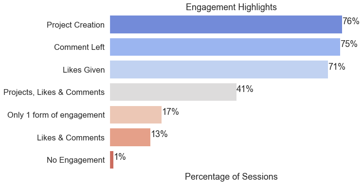

# Showwcase User Engagement Report, October 2019

## *Prepared by Justin August*

# Overview & Highlights

Given data from October 2019, Engagement Analysis was conducted.

## Methods 

### Errors 

Initial checks for errors and missingness were conducted.
- 2 records were completely missing and thus were dropped.
- 1 record was missing a single value for 'session_likes_given' and was able to be set to 'False' based on the non-corrupted data
- Several rows appeared to have 'inactive_duration' and 'session_duration' swapped as the difference between these would mean negative active duration seconds. These values were swapped

### Highlight Construction

Using [Sidetable](https://github.com/chris1610/sidetable) checks were made for percentages of posts with various engagement metrics and their intersections. The highlights and topline numbers were summarized below.

### Mean Session Data

The values for an average session were gathered and summarized into tables.

### Top Users & Bottom Users
Checks for top users (10) and bottom users (1 session per month) were made and values extracted.

## Engagement Highlights

## Sessions & Averages

|**Average Session**||
|---|---|
|**Active Time**|16 minutes|
|**Session length**|24 minutes|
|**Projects Created**|1.6|
|**Likes**|10.4|
|**Comments**|2.4|

- **300 total sessions**
- 48 unique users
- Top 10 users account for 55% of sessions
- 18 users have only  1 session

## Top User Profiles

|Engagement|Average|Maximum|Minimum|
|---|---|---|---|
|**Project Creation**|26|38|20|
|**Likes**|175|230|119|
|**Comments**|41|64|26|
|**Active Session Duration**|15.1 Minutes|18.7 Minutes|12.1 Minutes|
|**Total Session Time**|391 Minutes|543 Minutes|67 Minutes|

- **55% of all sessions**
- 164 total sessions

# Areas of Growth

## Low Engagement Users

|Engagement|Average|Maximum|Minimum|
|---|---|---|---|
|**Project Creation**|1.7|3|0|
|**Likes**|9.7|27|0|
|**Comments**|1.7|5|0|
|**Active Session Duration**|16.2 Minutes|34.1 Minutes|0 Minutes|
|**Total Session Time**|22 Minutes|36.5 Minutes|10.5 Minutes|

- 18 users with only 1 login this month
- Encountered ~21 bugs on average, 33 max, 12 min

# Possible Next Steps

## Content Analysis

- Not all Projects, Comments and Likes are created equal.
- What are throughlines in those engagements that highly engaged users create?
- What are throughlines in those engagements that low engagements users create?
- Mutual Engagements between users
	- Implicit sub-communities based on content, language or interests?

## Predictive Model for Creating High Engagement Users

**Data Sources**

- Demographic data
- Project content analysis
- Comment content analysis
- Likes content analysis

## Cluster Analysis

This data could benefit from a cluster analysis (K-means or other) to help identify potential user profiles that are using the platform and help us to create model user profiles to target with marketing and ads on other platforms.

